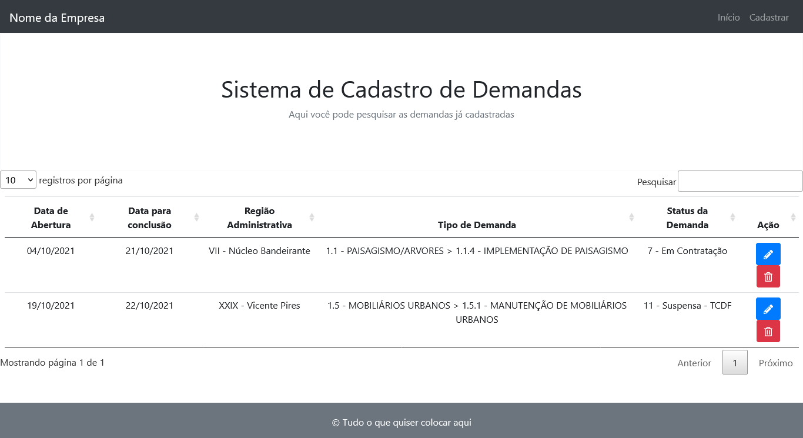

## Introdução

Este readme está dividido em:

- Introdução
- Descrição
- Funcionalidades
- Como instalar

## Descrição

Trata-se de um sistema desenvolvido em Laravel 5.5 para fins didáticos onde o usuário pode cadastrar/alterar/deletar seus funcionários. O sistema é responsivo, fazendo uso do framework Bootstrap.

## Funcionalidades

Tela de Home:
  Na tela de home temos uma tabela onde é possível pesquisar por nome, profissão, idade, entre outros dados dos funcionários. Foi utilizado o plugin Datatable do JQuery para a construção dessa tabela. Os funcionários são listados diretamente do banco. Aqui os dados são listados usando uma cláusula Join, pois temos 2 tabelas no sistema (uma com os dados dos funcionários e uma separada com opções de telefone deste usuário). Ao passar o mouse pela foto do funcionário, sua escala é levementa aumentada.

Tela de Cadastro:
  Na tela de cadastro de funcionários temos um formulário e os campos são validados com o plugin jQuery Mask. Após o cadastro, o usuário é redirecionado para a home e uma flash message é exibida durante 3 segundos.

Botão para alterar dados de funcionário:
  Na tela inicial podemos alterar os dados dos funcionários. A página vai trazer os dados que foram inseridos anteriormente na tela de cadastro. Os campos aqui também são validados com o plugin jQuery Mask. Também é exibido uma flash message caso a alteração ocorra com sucesso ou apresente erro.

Botão para deletar funcionário:
  Ao clicar em deletar funcionário, ele será deletado na tabela do banco e consequentemente da página Home. Também é exibido uma flash message. Ao deletar um funcionário, o auto incremento no banco é resetado, evitando que o campo 'id' pule do valor 1 para o 3 por exemplo, ao cadastrar novos usuários.

## Como instalar

Você vai precisar do:
- [Wampserver](https://www.wampserver.com/en/)
- [Composer](https://getcomposer.org/)

O Wampserver vai simular um host local em sua máquina. Com ele também vem junto o MySQLWorkbench, onde vamos importar nosso banco de dados.

O Composer é um gerenciador de dependências do PHP.

Para instalar o Wampserver siga este [tutorial](https://www.devmedia.com.br/instalacao-do-wampserver/25871)

Após baixar e instalar o Composer, verifique se ele está nas variáveis de ambiente do sistema. Para verificar isso, abra o cmd, digite "composer" e dê enter. Se aparecer uma tela com a versão e os comandos, ele já está configurado. Caso contrário: no Windows 10, basta abrir o Menu Iniciar e digitar "variáveis". Depois clique em "Variáveis de ambiente"; depois em "Variáveis do sistema" dê um duplo clique em "Path", clique em "Novo" e digite o local onde ele foi instalado, por exemplo: "C:\ProgramData\ComposerSetup\bin". Depois basta clicar em 'ok' ou 'aplicar'.

Após instalar o Wampserver, abra seu navegador e digite "localhost" para ver se está tudo ok.

Clone o projeto para sua máquina, na pasta "C:\wamp64\www". Abra o terminal na pasta que você acabou de clonar e digite o comando:
> composer install

Agora, acesse este [tutorial](https://www.visualdicas.com.br/index.php/tools/web-server/4-como-alterar-um-servidor-virtual-wamp-server) para configurar o virtual host do Wamp.

Abra seu MySQLWorkbench e importe o arquivo de dump chamado "dump-cadastro-funcionarios" localizado na pasta
> public/dump

Nesse arquivo temos o banco chamado "cadastro_funcionarios" e duas tabelas: "dados_funcionarios" e "telefone_funcionario". Temos como exemplo 3 funcionários cadastrados, cada um com seus respectivos telefones. O login do banco é "root" e a senha é vazia.

Depois de configurar o Virtual host e de importar o banco, acesse "http://sistema-cadastro-funcionarios" e clique em "public".

Se der um erro na exibição da página, renomeie o arquivo ".env.example" para ".env" (caso não exista, crie-o) e digite o comando (na pasta raíz do projeto):
> php artisan key:generate

Se você renomeou o ".env.example" para ".env" (ou o criou), digite neste ".env" o seguinte: "DB_DATABASE=cadastro_funcionarios", "DB_USERNAME=root", "DB_PASSWORD=".

## Imagem do Projeto

Para mais imagens, acesse a pasta
> public/img

Página home:

